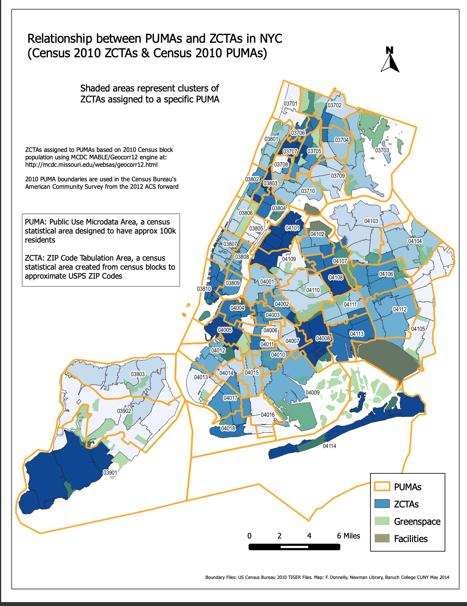

```{r libraries, message = FALSE}
library(tidyverse)
library(htmltools)
```

## Data Sources

### Integrated Public Use Microdata Series [(IPUMS USA)](https://usa.ipums.org/usa/)

The Integrated Public Use Microdata Series (IPUMS USA) consists of individual-level data from samples of the US population drawn from the American Community Surveys (ACS) of 2000 - present as well as from fifteen federal censuses from 1850 to 2010. Each record in IPUMS is a person with numerically coded characteristics and “weight” variables indicating how many persons in the population are represented by each record. Samples were created at different times by different investigators, which lead to a variety of documentation conventions. However, IPUMS applies consistent coding and documentation across records to allow for effective analysis over time. A data extraction system exists to allow users to pull particular samples and variables from IPUMS. This project uses demographic and macroeconomic data from the American Community Survey (ACS) 2019 five-year estimate via IPUMS.

While data from IPUMS is recorded at the individual-level, each interview is coded to a particular Public Use Microdata Area (PUMA) geography where the housing unit was located at the time of interview.



### New York City Department of Health and Mental Hygiene [(NYC DOHMH)](https://github.com/nychealth)

The New York City Department of Health and Mental Hygiene (NYC DOHMH) is one of the oldest public health agencies in the United States. Among other responsibilities, the DOHMH monitors the spread of infectious disease in NYC. The Department of Health classified the beginning of the COVID-19 pandemic as February 29, 2020, the date of the first laboratory-confirmed case. Since then, the DOHMH has recorded and reported COVID-19 data on a daily, weekly, or monthly basis. These data include cases, hospitalizations, and deaths by borough, modified Zip Code tabulation area (ZCTA), and demographic factors. As NYC has administered vaccinations for COVID-19, these data have been recorded and made available by borough, ZCTA, and demography. This project uses COVID-19 hospitalization rates, death rates, and vaccination rates by ZCTA in NYC.

### Baruch College, City University of New York - Geoportal [(Baruch, CUNY)](https://www.baruch.cuny.edu/confluence/display/geoportal/NYC+Geographies)

The Baruch Geoportal, maintained by the Newman Library at Baruch College, is a repository of geospatial resources including tabular data sets, tutorials, maps, and crosswalks. This project uses a crosswalk data set from Baruch Geoportal to apportion NYC ZCTAs to PUMAs, which allows PUMA-coded data from IPUMS to be analyzed alongside COVID-19 outcome data from DOHMH.

## Data Cleaning

As mentioned above, monthly outcome data were obtained from the NYC DOHMH with data reported at the ZCTA-level geography. First, these data were summed over the time interval March 2020 - September 2021 to obtain one cumulative incidence measure per ZCTA. However, the predictor variables from IPUMS were coded to the PUMA-level geography. The first step in the cleaning process was to convert these data into a [common geography](http://faculty.baruch.cuny.edu/geoportal/resources/nyc_geog/nyc_zcta10_puma10_areas.pdf) to facilitate further analysis. The Baruch ZCTA-PUMA crosswalk data set was used in this data conversion. Below is a brief excerpt:

```{r display zcta_puma_cross, message = FALSE}
zcta_puma_cross <- read_csv("./data/zcta_puma_cross.csv")

head(zcta_puma_cross)
```

The following  columns were used to convert ZCTA-level outcome data to PUMA-level data:

  * `zcta10` - ZCTA unique identifier
  * `puma10` - PUMA unique identifier
  * `per_in_puma` - percentage of the specified ZCTA that is located within the specified PUMA
  * `per_of_puma` - percentage of the specified PUMA that is occupied by the specified ZCTA

The following shows the mathematical expression used to convert from ZCTA-level outcome data ($Z_i$) to PUMA-level outcome data ($P_j$):

$$
\sum_{i = 1}^{n} \text{Z}_{i} \cdot \text{per_in_puma}_{ij} \cdot \text{per_of_puma}_{ij} = \text{P}_j
$$

This resulted in one cumulative incidence measure per PUMA (per 100,000 people for hospitalizations and deaths, a percentage for vaccinations).

The demographic dataset from IPUMS originally contained over 350,000 interviews from the NYC area, each coded to a PUMA and given a ‘perwt’ - person weight and ‘hhwt’- household weight. First, predictor variables were renamed and recoded according to the data dictionary [(see data dictionary)](census_documentation.html) such that the following predictor variables were obtained for each interview along with ‘borough’ and ‘puma’ coding:

  * `rent`: monthly rent (numeric)
  * `household_income`: annual household income (numeric)
  * `on_foodstamps`: whether a person is on food stamps (binary)
  * `has_broadband`: whether a person has broadband internet (binary)
  * `family_size`: number of individuals in family, including this individual (numeric)
  * `num_children`: number of children in family (numeric)
  * `sex`: sex of individual (binary)
  * `age`: age of individual (numeric)
  * `race`: race of individual (categorical factor)
  * `birthplace`: whether this person was born in US or elsewhere (categorical factor)
  * `US_citizen`: whether this person is a US citizen (categorical factor)
  * `language`: primary language spoken at home (categorical factor)
  * `education`: highest level of education obtained (categorical factor)
  * `employment`: current employment status (categorical factor)
  * `health_insurance`: type of insurance (public or private), if any (categorical factor)
  * `personal_income`: annual personal income (numeric)
  * `on_welfare`: whether person is on welfare (binary)
  * `poverty_threshold`: whether the person is above or below the poverty line (binary)
  * `work_transport`: most commonly used method of transportation to work (categorical factor)

After cleaning variable names the 350,000+ interviews were summarized to the PUMA-level based on ‘perwt’ and ‘hhwt’. For each interview, the ‘perwt’ value describes the number of persons in the coded geographic area (PUMA) for which the interview is representative. For example, a ‘perwt’ of 34 indicates that there are 34 persons in the PUMA that share the same characteristics as described in the interview data (e.g., similar income, race, family size, etc.). The same is true of the ‘hhwt’ value for households in the coded PUMA. Therefore, the ‘perwt’ and ‘hhwt’ of each interview can be used to aggregate interview-level data to PUMA-level data as follows:

```{r nyc_hh_summary, eval = FALSE}
nyc_hh_summary = cleaned_data %>% 
  group_by(puma) %>%
  summarize(
    total_people = sum(perwt),
    median_household_income = weighted.median(household_income, hhwt, na.rm = TRUE),
    perc_foodstamps = sum(hhwt[on_foodstamps == "Yes"]) * 100 / sum(hhwt),
    perc_broadband = sum(hhwt[has_broadband == "Yes"]) * 100 / sum(hhwt),
    perc_male = sum(perwt[sex == "Male"]) * 100 / sum(perwt),
    median_age = weighted.median(age, perwt, na.rm = TRUE),
    perc_white = sum(perwt[race == "White"]) * 100 / sum(perwt),
    perc_foreign_born = sum(perwt[birthplace == "Non-US"]) * 100 / sum(perwt),
    perc_citizen = sum(perwt[US_citizen == "Yes"]) * 100 / sum(perwt),
    perc_english = sum(perwt[language == "English"]) * 100 / sum(perwt),
    perc_college = sum(perwt[education %in% c("Some College", "Bachelor's Degree", "Post-Graduate Degree")]) * 100 / sum(perwt),
    perc_unemployed = sum(perwt[employment == "Unemployed"]) * 100 / sum(perwt),
    perc_insured = sum(perwt[health_insurance %in% c("Private", "Public")]) * 100 / sum(perwt),
    median_personal_income = weighted.median(personal_income, perwt, na.rm = TRUE),
    perc_welfare = sum(perwt[on_welfare == "Yes"]) * 100 / sum(perwt),
    perc_poverty = sum(perwt[poverty_threshold == "Below"]) * 100 / sum(perwt),
    perc_public_transit = sum(perwt[work_transport == "Public Transit"]) * 100 / sum(perwt),
    covid_hosp_rate = median(puma_hosp_rate),
    covid_vax_rate = median(puma_vacc_rate),
    covid_death_rate = median(puma_death_rate)
  )
```

This cleaned and aggregated data set has 55 rows, one for each PUMA, and is the basis of our exploratory analysis.


